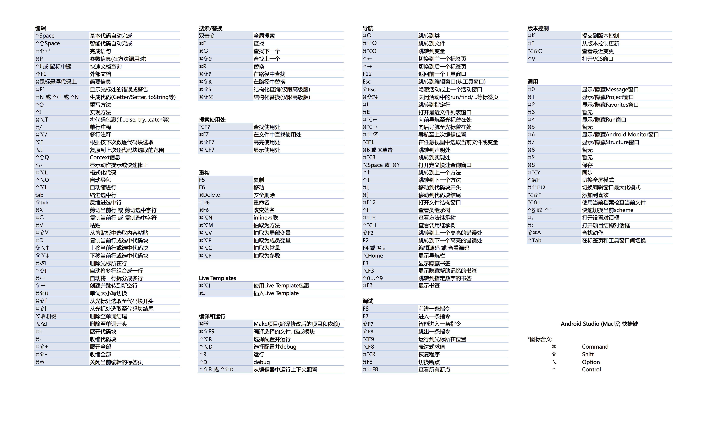

# Android-Studio-Keymap-for-Mac-ZH

## Intro
Android Studio shortcut keymap for mac in simplified Chinese. 
Suitable for setting as a wallpaper of MBP.

- Resolution: 4800*3000 (13.3')

> **Note:**
> Some shortcuts may be conflicted with Mac shortcuts, such as `F1` etc. You may need to use `Fn` combine with them.

## Keymap

## Thanks
Any correction will be appreciated!